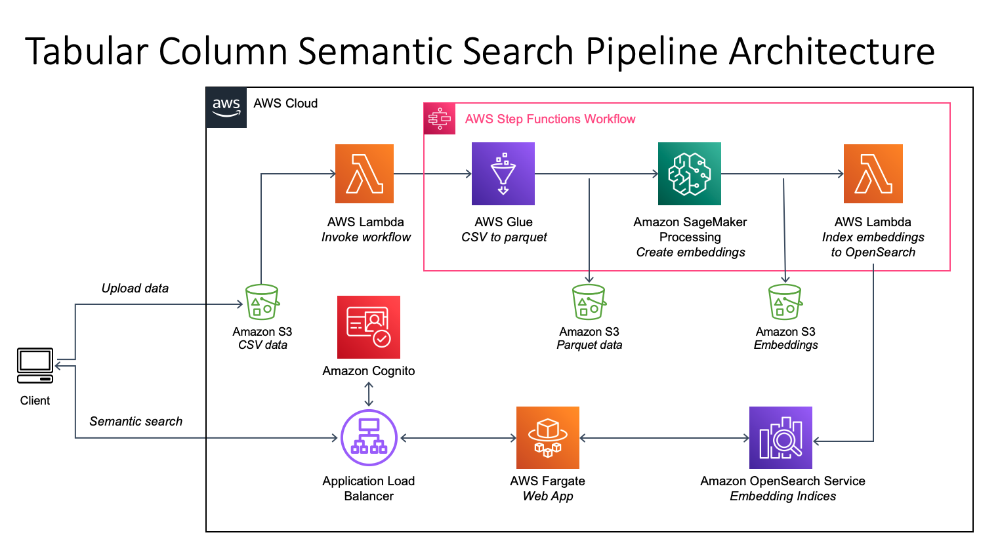

# Tabular Column Semantic Search

### This app creates the following:
1. An automated pipeline for embedding column data from CSVs and indexing the embeddings to OpenSearch.
2. A web app enabling users to search for the approximate nearest neighbors to a provided input.

Services used:
- [AWS Step Functions](https://docs.aws.amazon.com/step-functions/?id=docs_gateway)
- [AWS Glue](https://docs.aws.amazon.com/glue/?id=docs_gateway)
- [Amazon SageMaker Processing](https://docs.aws.amazon.com/sagemaker/?id=docs_gateway)
- [AWS Lambda](https://docs.aws.amazon.com/lambda/?id=docs_gateway)
- [Amazon OpenSearch Service](https://docs.aws.amazon.com/opensearch-service/?id=docs_gateway)
- [Amazon S3](https://docs.aws.amazon.com/s3/?id=docs_gateway)
- [Amazon ECR](http://aws.amazon.com/ecr/)
- [AWS Fargate](https://docs.aws.amazon.com/ecs/index.html)
- [Application Load Balancer (ALB)](https://docs.aws.amazon.com/elasticloadbalancing/latest/application/introduction.html)

Embeddings are created using [SentenceTransformers](https://www.sbert.net/).
By default the following models are used:
- `all-MiniLM-L6-v2`
- `all-distilroberta-v1`
- `average_word_embeddings_glove.6B.300d`



### Deployment prerequisites
1. [AWS CDK](https://docs.aws.amazon.com/cdk/v2/guide/getting_started.html)
2. [Docker](https://docs.docker.com/get-docker/) running in the background

### How do I use this pipeline and web app?
1. Customize email, username, and any other desired configs in [config.yaml](config.yaml).
2. Deploy resources by following the steps [below](#steps-to-deploy).
        **Recommended**: Deploy CDK from a cloud based instance such as EC2 or Cloud9.
3. Once deployed, upload CSV files with column headings to the `data/csv/input/file` or `data/csv/input/batch` paths of the S3 bucket created during deployment. Files uploaded to `data/csv/input/file` will be individually processed automatically upon upload. Files uploaded to `data/csv/input/batch` will be processed in batch when the pipeline is manually triggered. During pipeline execution, input data will be automatically embedded and indexed to OpenSearch. After successful indexing, input data is moved to `data/csv/processed/`. You can track the pipeline status in the Step Function State Machine console.
    * To upload batch CSV files, run the script [run_pipeline.py](tools/run_pipeline.py) from the commandline:
        The default options for the script will upload sample batch datasets from [sample-batch-datasets.json](sample-batch-datasets.json) to the S3 bucket (`<DESTINATION_BUCKET>/data/csv/input/batch`). And invoke the Lambda function that starts pipeline.
        ```
            python tools/run_pipeline.py --destination_bucket <DESTINATION_BUCKET> --input_mode batch --batch_datasets_file sample-batch-datasets.json
        ```
    * To upload a single CSV file, run the same script [run_pipeline.py](tools/run_pipeline.py) with the following
        ```
            python tools/run_pipeline.py --destination_bucket <DESTINATION_BUCKET> --input_mode file --file_or_url <LOCAL_OR_REMOTE_CSV_PATH>
        ```
4. After deployment, you will receive sign-in credentials and the web app URL via email, at the email you specified in [config.yaml](config.yaml). Log in to the web app using these credentials. You will be prompted to reset your password during the first login.
    * Note the demo creates and uses a self-signed certificate for the web app, which may not be trusted by your web browser by default. Self-signed certificates should not be used beyond testing. For best security, use a certificate signed be a credible CA. 
5. Use the web app to query OpenSearch and explore results.

### Steps to deploy
Create a virtual environment:

```
$ python3 -m venv .venv
```

Activate your virtualenv:

```
$ source .venv/bin/activate
```

Install the required dependencies:

```
$ pip install --upgrade pip
$ pip install -r requirements.txt
```

At this point you can synthesize the CloudFormation template for this code:

```
$ cdk synth
```

Bootstrap your default AWS account/region. Note you may incur AWS charges for data stored in the bootstrapped resources.

```
$ cdk bootstrap
```

Deploy the pipeline to your default AWS account/region. Note Docker needs to be running in the background. During deployment, you will be prompted to confirm deployment of each stack. Resources will incur charges in your account while deployed.

```
$ cdk deploy --all
```

To tear down the pipeline, run the following aptly named command. You will be prompted to confirm deletion.

```
$ cdk destroy --all
```

## Useful commands

 * `cdk ls`          list all stacks in the app
 * `cdk synth`       emits the synthesized CloudFormation template
 * `cdk deploy`      deploy this stack to your default AWS account/region
 * `cdk diff`        compare deployed stack with current state
 * `cdk docs`        open CDK documentation
 * `cdk destroy`     destroy existing stack
